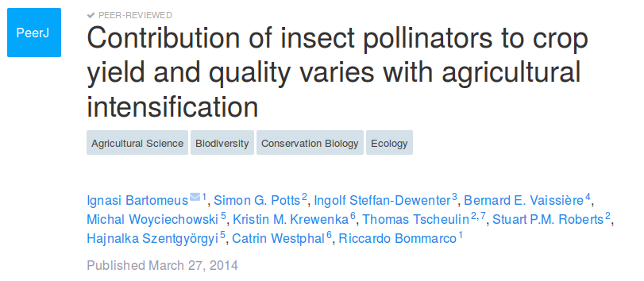
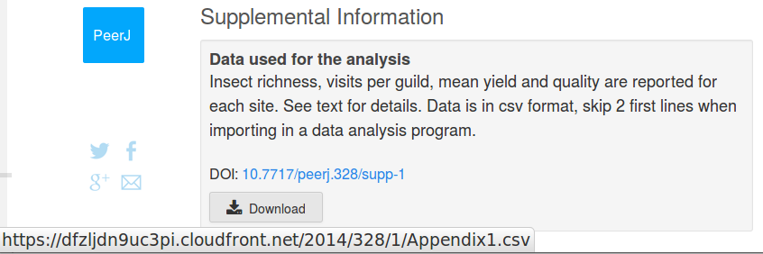

<!--------------------------------------------
R FOR LIFE SCIENCES. CHAPTER 3: Basic graphics and data.
--------------------------------------------->

```{r setup, include=FALSE}
#·····································································
#=====================================================================
#               OPCIONES KNITR
#=====================================================================
knitr::opts_chunk$set(echo = TRUE,
                      fig.path  = '../Resultados/',
                      fig.width = 8, fig.height = 6,
                      dpi = 250)
#·····································································
#  En la plantilla está definido 
#  que el estilo TITULO1 tiene un salto de página en DOCX
#  LICENCIA CREATIVE COMMONS
######################################################################
# Esta es la longitud del código sin salirse en ningún formato
```
<!--------------------------------------------
               PRIMERA PÁGINA
--------------------------------------------->

***

&nbsp;

&nbsp;

&nbsp;

&nbsp;

 Cite as: Alfonso Garmendia
 (`r format(Sys.time(), '%Y')`)
 R for life sciences. 
 Chapter 2: Operations in R.
 <http://personales.upv.es/algarsal/Documentation/Garmendia-R-Tutorial-03_Graphics.html>

available in
 [PDF](http://personales.upv.es/algarsal/Documentation/Garmendia-R-Tutorial-03_Graphics.pdf)  and [EPUB](http://personales.upv.es/algarsal/Documentation/Garmendia-R-Tutorial-03_Graphics.epub)

&nbsp;

&nbsp;

&nbsp;

***  

<div style="width: 25%; height: 25%">

</div>

This work is licensed under a [Creative Commons Attribution-NonCommercial-ShareAlike 4.0 International License](http://creativecommons.org/licenses/by-nc-sa/4.0/ "License").

&nbsp;

Written in [Rmarkdown](http://rmarkdown.rstudio.com/), using [Rstudio](https://www.rstudio.com/) and [pandoc](http://pandoc.org/).

***  

\pagebreak

# Basic graphics and data

<!--------------------------------------------
##########################################################
    AQUÍ EMPIEZA REALMENTE EL CAPÍTULO.
    Acordarse que los #titulo1 son salto de pagina en word
##########################################################
--------------------------------------------->

## Basic graphics with one variable

One of the main reasons to use R instead of statistical programs is for its strong graphical capabilities. To see some of these capabilities, write **demo(graphics)**. 

Basic graph types are density plots, dot plots, bar charts, line charts, pie charts, box-plots and scatter plots.

Plots in R have two types of commands, high-level commands to create the plot and low-level commands to add things to the plot, once it has been created. These low-level commands will do nothing if there is not an active plot. 

Some of the most used low-level commands are:

points () : 
  : Add points

lines() : 
  : Add a line graph
    
abline () : 
  : Add a straight line

title() : 
  : Add a title

legend() : 
  : Add a legend

text() : 
  : Add a text string at the desired coordinates into a figure. 

The main primary command is **plot()**. Depending the input data, it will do the type of plot that best fit. But of course is possible to change. Looking at the help(plot) page is very advisable before start and take a look into the arguments. Changing for example the type of plot.


```{r}
################ BASIC GRAPHS ###################
# Define the greenfly vector with 5 values
greenfly <- c(1, 3, 6, 4, 9)

################ POINTS #########################
# Graph the greenfly vector with all defaults
plot(greenfly)

################ LINES  #########################
# Graph the greenfly vector with a line
plot(greenfly, type = "l")

################ BARPLOT ########################
# Names for the bars
years <- as.character(1999:2003)
# Graph the greenfly vector with barplot
barplot(greenfly, names.arg = years)

################ PIE PLOT #######################
# Graph the greenfly vector with a line
pie(greenfly, labels = years)

################ BOX PLOT #######################
# Graph the greenfly vector with a boxplot
boxplot(greenfly)

####### HISTOGRAM WITH FREQUENCIES ##############
# Graph the greenfly vector with a histogram with frequencies
hist(greenfly)

##### HISTOGRAM WITH PROBABILITY DENSITIES ######
# Graph the greenfly vector with a histogram with probability densities
hist(greenfly, freq = F)
# ADD other graph with density
lines(density(greenfly), col = "red")

################ LINES AND POINTS ###############
# Graph greenfly using blue points overlayed by a line
# and with bold/italic title
plot(greenfly, type = "o", col = "blue"
     , main = "Greenfly", font.main = 4)

####### TWO GRAPHS WITH LOW-LEVEL COMMANDS #######
# Define other vector
aphids <- c(2, 5, 4, 5, 12)
#
# Graph greenfly using a y axis that ranges from 0 to 12
plot(greenfly, type = "l", col = "blue"
     , ylim = c(0,12), x = years)
#
# Add graph for aphids with red dashed line
lines(aphids, type = "l", lty = 2, col = "red", x = years)

# Add a title with red and bold/italic font
title(main = "Aphids and greenfly"
      , col.main = "red", font.main = 4)
#
# Add legend
legend("topleft", c("greenfly", "aphids")
       , col = 1:2, lty = 1:2)
```

For more details on how to make graphs in R,there is a lot of accessible material into Internet, like tutorials^[[Quick-R](http://www.statmethods.net/graphs/)], books^[[Chang 2013](http://bioinformaticsonline.com/file/view/29638/r-graphical-cookbook-by-winston-chang)] ^[[Murrel 2011](https://www.crcpress.com/R-Graphics-Second-Edition/Murrell/p/book/9781439831762#googlePreviewContainer)], and example graphics ^[[r-graph-gallery](http://www.r-graph-gallery.com/)] ^[[Murrel](https://www.stat.auckland.ac.nz/~paul/RG2e/)] some of them very good ones. 

## Graphs that help make graphs

One of the problems everyone faces when making graphs in R is the use of numbers to name colors, point and  line types, etc. A good idea to deal with this is to be able to make a tutorial graph like these ones:

```{r, fig.width = 8, fig.height = 3}
##### Cheat-sheet for pch (point type) ######
plot(0, 0, xlim = c(0, 21), ylim = c(0.5, 1.5)
     , ylab = "", xlab = "", yaxt = "n")
axis(2, 1, labels = c("pch"))
for (i in 1:20) {
    points(i, 1, pch = i, cex = 3)
}

#### Cheat-sheet for colors ####
plot(0, 0, xlim = c(0, 21), ylim = c(0.5, 1.5)
     , ylab = "", xlab = "", yaxt = "n")
axis(2, 1, labels = c("col"))
for (i in 1:20) {
    points(i, 1, pch = 15, col = i, cex = 3)
}

```

Or combine several in one:

```{r, fig.width = 8, fig.height = 4}
#### Cheat-sheet for ALL ####
num = 0 ; num1 = 0
plot(0, 0, xlim = c(0, 21), ylim = c(0.5, 3.5)
     , yaxt = "n", ylab = "", xlab = "")

### Add axis
axis(2, at = c(1, 2, 3), labels = c("pch", "col", "lty"))

### Fill the graph
for (i in seq(1,20)) {
  points(i, 1, pch = i, cex = 3)                        # pch
  points(i, 2, col = i, pch = 15 , cex = 3)             # col
  #lty
  if (i %in% c(seq(1, 18, 3))) {
        num = num + 1
    points(c(i, i + 2), c(3, 3)
           , col = "black"
           , lty = num, type = "l", lwd = 2)
        text(i + 1.1, 3.15, num)
  }
}
```


## Data files inside R and graphs with two or more variables

We have already created data using c() ^[**?c** to see the help page], vector(), matrix(), data.frame() and list(), and also converted ones into others using as.factor(), as.data.frame(), etc. 
Other important source of data for training are the data files already housed into R packages and used for the examples in help() ^[**?help** to see the help page] or demo(). 

This data files are also very useful for training and teaching R. We have used some already (e.g. **iris**) and will use them more latter. They are also the easiest way for asking questions into forums and other webs, because it avoids all the problems of importing and exporting data. 

Use **data()** to see all data available from package "datasets" of from other packages. 

We can explore the **plot()** possibilities with iris data frame. It uses different graphs depending on the input data.

### Plot a data frame

```{r}
##### BASIC PLOTS WITH IRIS ####
# plot.data.frame() and pairs() will output same results.  
plot(iris)                     # Data frame. All variables as.numeric
```

Observe that Species is a categorical variable. It has been converted to numeric, but obviously this is not the best way to represent a categorical variable. It is better this other way:

```{r}
### Same plot with only 1:4 variables and colors by Species
plot(iris[1:4], col = iris$Species )              # colors by species
```

### Plot two variables relationships

```{r}
### Dependent variable numeric, independent variable categorical
plot(iris$Petal.Length ~ iris$Species) # Same that boxplot()

### Two numeric variables, color by species, title and legend
PETAL <- iris$Petal.Length                       # Numeric variable 1
SEPAL <- iris$Sepal.Length                       # Numeric variable 2
SP    <- iris$Species               # Categorical variable for colors

### Scatterplot
plot(SEPAL~PETAL, col = SP, xlab = "Petal length (cm)", 
     ylab = "Sepal length (cm)")                        

### low-levels
title("Example of scatterplot")           # low-level command title()
legend("bottomright", levels(SP), pch = T,col = c(1:3))    #low-level

```


## Random data

Sometimes may be interesting to use random data. This can be done using the command **sample()** ^[**?sample** to see the help page] to take a sample of the specified size from a vector. 

Other useful command to generate random numbers is **runif()** ^[**?runif** to see the help page]. See its help page for more info.

Random data following a particular distribution are very useful for simulations. Usually with distributions from package **stats** ^[see **?distributions**] there is enough, but if you need more you can look [here](https://cran.r-project.org/web/views/Distributions.html).

### Plotting distributions histograms

```{r}
#### HISTOGRAMS OF DISTRIBUTIONS #####
?Distributions

### Plot with random normal (0,1) data
x <- rnorm(100, mean = 0, sd = 1)                 # Random normal data
hist(x, freq = F, ylim = c(0, 0.5))               # Histogram 

### Plot normal density over the histogram
xl <- seq(-5, 5, length = 100)          # sequence of numbers
y <- dnorm(xl, mean = 0, sd = 1)        # Normal densities for x
lines(xl, y, col = "red")               # Red line with distribution

### Plot graphic with ten normal distributions using for() 
x   <- seq(-15, 15, length = 1000)      # Sequence of 1000 numbers
y   <- dnorm(x, mean = 0, sd = 1)       # Normal densities for x
plot(x, y, type = "n")                  # Empty plot (type = "n")

### Plot lines over first plot 
for (i in 1:10) {                   # Ten lines with sd from 1 to 10
    y <- dnorm(x, 0, i)             # Calculate the normal density
    lines(x, y, col = i)           # Plot the line
}

### Legend
legend("topright", legend = paste("sd =", 1:10)
       , lty = 1, col = 1:10)
title(main = "normal distributions, mean = 0, sd = 1:10")

##### OTHER DISTRIBUTIONS #####

### Plot graphic with ten CHI-SQUARE distributions using for()
x   <- seq(-1, 20, 1)                # Sequence
y   <- dchisq(x, df = 2)             # densities for x
plot(x, y, type = "n")               # Empty plot (type = "n")

### Plot lines over first plot
for (i in 1:10) {                    # Ten lines with DF from 1 to 10
    y <- dchisq(x, df = i)           # Calculate density
    lines(x, y, col = i)              # Plot the line
}

### Legend and title 
legend("topright", legend = paste("df =", 1:10),lty = 1, col = 1:10)
title(main = "Chi-square distributions, df = 1:10")

#### Plot graphic with ten BINOMIALS distributions using for() ######
x   <- seq(0, 25, 1)                    # Sequence
y   <- dbinom(x, prob = 0.5, size = 3)  # densities for x
plot(x, y, type = "n")                  # Empty plot (type = "n")

### Plot lines over first plot
for (i in 1:10) {          # Ten lines with SIZES from 1 to 10
    y <- dbinom(x, prob = 0.5, size = i * 3)    # densities for x
    lines(x, y, col = i)                       # Plot the line
}
### Legend and title
legend("topright", legend = paste("df =", 1:10*3)
       , lty = 1, col = 1:10)
title(main = "Binomial distributions, probability = 0.5, size = 3:30")

```

## Export figures 

Once we have a nice picture, we may want it outside R, usually in a given format, size and resolution.

Possible output formats are: jpeg, bmp, png, tiff. All of them can be done with the chosen size and resolution. See the help page of **jpeg()**^[**jpeg()**: ?jpeg for help] for more information.

Other possible output format is pdf.  See the help page for **pdf()**^[**pdf()**: ?pdf for help] for more information. 

The main difference between pdf and the other formats is that in pdf() format we can introduce as many pictures as we want before closing the device, while in others (eg. jpeg) if we start a new plot, it will overwrite the previous one and we will only output the last one before closing the device.

With any of these commands what we are actually doing is opening a device or graphical window different from the default R one. Once we have finished our graph, we have to close this device, with **dev.off()**.

```{r, eval=F}
#### jpeg plot ####
jpeg(filename = "Plot1.jpeg")           # Open the device "Plot1.jpeg"
plot(iris[1:4], col = iris$Species)    # make the plot into the device
dev.off()              # Close the device. Do not forget to put the () 
#### See the plot into the working directory. getwd() to see where.

```

It is possible to change the size, background color, resolution, etc. 

```{r, eval=F}
#### tiff plot ####
tiff("Plot1.tiff", width = 12, height = 10, units = "cm", 
     bg = "transparent", res = 150)       # Open the device "Plot1.tiff"
plot(iris[1:4], col = iris$Species)    # make the plot into the device
dev.off()              # Close the device. Do not forget to put the () 
#### See the plot into the working directory. getwd() to see where.

```

Look for the differences between Plot1.jpeg and Plot1.tiff. Change the parameters and see the results. A very useful background color is bg = "transparent". 

## Import - export data

The best format for data is always plain text. We can find data in plain text with different extensions: **.txt** for text; **.csv** for comma separated values. In Spain and other countries, the comma is used as decimal separator and therefore is not a good idea to use the comma also to separate values. A better way to separate values into a .csv is by semicolons ; or by tabs. 

To see how to import and export data we will first export the data form iris into a file called IrisFile.csv separated by semicolons and with comma as decimal separators, and then import those data from the file.  

```{r}
#### Export iris
write.table(iris, file = "IrisFile.csv", dec = ",", sep = ";")

```

See the table into the working directory. Try to open it with a plain-text editor, with excel or with LibreOffice. Be careful, do not save changes without changing the name because some programs (especially Excel) usually change the format. 

Now, to import a data file:

```{r}
#### Import IrisFile.csv
MyIris <- read.table("IrisFile.csv", dec = ",", sep = ";")
str(MyIris)                  # Check if it has been correctly imported

```

In both cases, export and import, we can specify the folder where we want (or have) the data table into the file name. By now it is a good idea to keep everything into the working directory. 

### Import data from web site

It is also possible to import data from a web site. For example if we want to import the original data from this article: 
<https://peerj.com/articles/703/>
We can download the data from the link and then import it with **read.table()** or read.csv(), but it would be easier to put directly the URL direction. 
Note: If the data are heavy and we are going to download them many times, it may be better the first option for downloading the data only once. 

```{r, warning=F, cache=T}
#### Import csv from web 
# Original CSV
Webcsv <- "http://datadryad.org/bitstream/handle/10255/dryad.63704/Feeding_Assays.csv"
Data <- read.table(Webcsv, header = T, sep = ",")
str(Data)                    # Check if it has been correctly imported
```

### Other data formats

There are particular commands and packages in R for working with data in different formats: 

**"readxl"** package, with **read_excel()**:
  : While read_excel() auto detects the format from the file extension, read_xls() and read_xlsx() can be used to read files without extension. 

**"writexl"** package, with **write_xlsx()**: 
  : Writes a data frame to an xlsx file.

Other packages as **"xlsx"** sometimes are difficult to install because they need to have a good java version installed in the computer. 

**"shapefiles"**, **"maptools"**, **"rgdal"**, **"spatstat"** packages:
  : To read and work with shape-files and maps. 

**"ape"** package:
  : To read DNA sequences. 
  
***

\pagebreak

# Exercises

```{r echo = F, eval=T}
#### eval = F to see the results, T to hide results
knitr::opts_chunk$set(echo = F, eval = F)
```


1. Plot a cheat-sheet with values of color and point type (col = , and pch = ) from 1 to 25, and export it as a jpeg of 15 cm wide, 6 cm high and resolution 100 points per cm. 

```{r, fig.width = 8, fig.height = 3}
#### Cheatsheet.jpeg with colors and point types ####
### Activate jpeg
jpeg("Cheatsheet.jpeg", width = 15, height = 6, units = "cm", res = 100)

### Start Plot
plot(0, 0
     , xlim = c(0,26)
     , ylim = c(0.5,1.5)
     , ylab = ""
     , xlab = ""
     , yaxt = "n")

axis(2, at = 1
     , labels = c("pch")
     , tick = TRUE, las = 1
     , cex.axis = 0.8)

for (i in 1:25) {
    points(i, 1 , pch = i, col = i, cex = 1)
}

dev.off     # Close JPEG

```

2. Plot into a graph ten Poisson distributions with lambda ranging from 1 to 10. Put legend and title. Export it as a .tiff file with size of 15x15 cm. 

```{r Poisson_distributions.tiff}
### Variables
x   <- seq(0, 20, by = 1)           # Sequence
y   <- dpois(x, lambda = 1)        # densities for x

### Activate TIFF
tiff("Poisson_distributions.tiff"
     , width = 15
     , height = 15, units = "cm", res = 100
     , compression = "lzw"          # file compression
     )

### Empty plot
plot(x, y, type = "l")               # Empty plot (type = "n")

### Plot lines over first plot
for (i in 1:10) {       # Ten lines with LAMBDA from 1 to 10
    y <- dpois(x, lambda = i)      # densities for x
    lines(x, y, col = i)            # Plot the line
}
### Legend and title
legend("topright", legend = paste("df =", 1:10)
       ,lty = 1, col = 1:10)
title(main = "Poisson distributions, Lambda = 1:10")

dev.off()       # Off device

### Clean
rm(i, x, y)

```

3. Import data from this article: <https://peerj.com/articles/328/>

[](https://peerj.com/articles/328/)

[](https://peerj.com/articles/328/#supp-1)

Be careful importing the data. Notice that you have to skip two first lines using "skip = 2"^[**?read.table** for help]. 

With these data, using for(), plot graphs to represent the effect of all the numerical variables, from "richness" to "mean_quality" on "yield". Choose the type of graph that you think better represents this effect for the different species. Create only one pdf with all the graphs inside. 

```{r}
###  Import data
Data <- read.csv("https://dfzljdn9uc3pi.cloudfront.net/2014/328/1/Appendix1.csv", skip = 2)
str(Data)

### PDF
pdf("effect_on_yield.pdf")

### VARIABLES
for (i in names(Data[c(6:12)])) {                 # Numeric variables
    # Define variables
    X <- Data[[i]]
    Y <- Data$mean_yield
    Z <- Data$crop
    # plot
    plot(Y ~ X, col = as.numeric(Z),main = i
         , xlab = i, ylab = "Mean Yield")
    legend("topleft", legend = levels(Z),pch = 1, col = 1:4)
}

### close PDF
dev.off()

### clean
rm(i, X, Y, Z)

```


